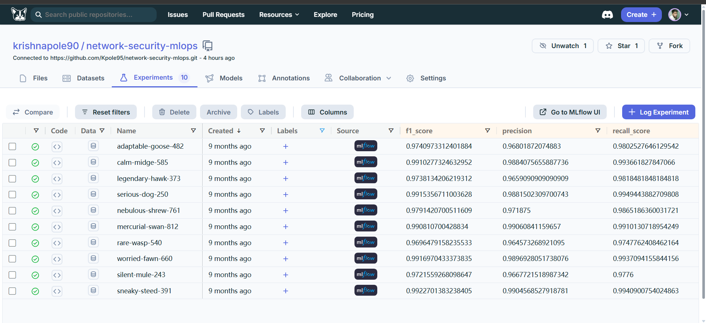

# Phishing URL Detection — End-to-End MLOps Pipeline

[](https://github.com/Kpole95/network-security-mlops/actions)
[](https://dagshub.com/krishnapole90/network-security-mlops/experiments)
[](https://www.python.org/)
[](https://aws.amazon.com/ecr/)
[](https://fastapi.tiangolo.com/)

A production-grade MLOps pipeline for detecting phishing URLs using machine learning. Built with modular components, full experiment tracking, automated CI/CD, and cloud deployment on AWS.

---

## Results

| Metric | Best Run | Average (10 runs) |
|---|---|---|
| **F1 Score** | **99.23%** | 98.26% |
| **Precision** | **99.05%** | 97.84% |
| **Recall** | **99.41%** | 98.68% |

**Best model:** `sneaky-steed-391` — tracked on [DagsHub MLflow](https://dagshub.com/krishnapole90/network-security-mlops/experiments)

---

## Architecture

```
MongoDB Atlas
     │
     ▼
┌─────────────────────────────────────────────────────────┐
│                    Training Pipeline                     │
│                                                         │
│  DataIngestion → DataValidation → DataTransformation    │
│       │               │                  │              │
│  Fetch from       KS-test drift     KNNImputer          │
│  MongoDB          detection         sklearn Pipeline    │
│                       │                  │              │
│                       ▼                  ▼              │
│               DataValidationArtifact    .npy arrays     │
│                                         │               │
│                              ModelTrainer               │
│                         5 models + GridSearchCV         │
│                         MLflow experiment tracking      │
│                                   │                     │
│                          Best model selected            │
│                          Saved to final_model/          │
└─────────────────────────────────────────────────────────┘
          │                          │
          ▼                          ▼
    S3 (artifacts)           FastAPI Inference
    S3 (final_model)         /predict endpoint
                                    │
                             Docker → ECR
                                    │
                         GitHub Actions CI/CD
                    (lint → ECR push → deploy)
```

---

## Dataset

**Source:** UCI ML Repository — Phishing Websites Dataset  
**Records:** 11,055 URLs  
**Features:** 30 ternary-encoded URL characteristics (`-1` = suspicious, `0` = neutral, `1` = legitimate)  
**Target:** `Result` — Phishing (`1`) vs Legitimate (`-1`)  
**Class balance:** 55.7% phishing / 44.3% legitimate  
**Missing values:** None

### Feature categories

| Category | Examples |
|---|---|
| URL-based | `having_IP_Address`, `URL_Length`, `Shortining_Service`, `having_At_Symbol` |
| Domain-based | `Domain_registeration_length`, `age_of_domain`, `DNSRecord` |
| HTML/JS | `Iframe`, `on_mouseover`, `RightClick`, `popUpWidnow` |
| External services | `Page_Rank`, `Google_Index`, `web_traffic`, `Statistical_report` |
| SSL/Security | `SSLfinal_State`, `HTTPS_token`, `Favicon` |

---

## Pipeline Components

### 1. Data Ingestion (`data_ingestion.py`)
- Connects to MongoDB Atlas via TLS/SSL
- Exports collection to pandas DataFrame
- Removes MongoDB `_id` column, replaces `"na"` strings with `np.nan`
- Splits into train/test sets (80/20)
- Saves as timestamped CSV artifacts

### 2. Data Validation (`data_validation.py`)
- Schema validation against `data_schema/schema.yaml`
- Column count and numerical column existence checks
- **Kolmogorov-Smirnov drift detection** across all 30 features (threshold: p < 0.05)
- Generates per-column drift report as YAML
- Blocks pipeline if critical drift detected

### 3. Data Transformation (`data_transformation.py`)
- **KNNImputer** (k=3, uniform weights) for missing value handling
- Encapsulated in a reusable sklearn `Pipeline` object
- Fitted on train set only — applied to test set (no leakage)
- Saves preprocessor as `preprocessing.pkl` for inference reuse
- Outputs NumPy `.npy` arrays for training

### 4. Model Training (`model_trainer.py`)
- Evaluates **5 classifiers** with GridSearchCV (3-fold CV):
  - Random Forest, Gradient Boosting, AdaBoost, Decision Tree, Logistic Regression
- Logs **F1, precision, recall** to MLflow on every run via DagsHub
- Selects best model by test score
- Saves `NetworkModel` wrapper (preprocessor + model) for clean inference
- Syncs model artifacts to S3

### 5. Cloud Sync (`s3_syncer.py`)
- `aws s3 sync` pushes all timestamped artifacts to S3
- Separate sync for pipeline artifacts vs final model
- Enables artifact versioning and rollback by timestamp

---

## Experiment Tracking

10 experiment runs tracked on DagsHub MLflow:

| Run | F1 | Precision | Recall |
|---|---|---|---|
| sneaky-steed-391 ⭐ | 0.9923 | 0.9905 | 0.9941 |
| worried-fawn-660 | 0.9917 | 0.9897 | 0.9937 |
| serious-dog-250 | 0.9915 | 0.9882 | 0.9949 |
| calm-midge-585 | 0.9910 | 0.9884 | 0.9937 |
| mercurial-swan-812 | 0.9908 | 0.9906 | 0.9910 |
| nebulous-shrew-761 | 0.9791 | 0.9719 | 0.9865 |
| adaptable-goose-482 | 0.9741 | 0.9680 | 0.9803 |
| legendary-hawk-373 | 0.9738 | 0.9659 | 0.9818 |
| silent-mule-243 | 0.9722 | 0.9668 | 0.9776 |
| rare-wasp-540 | 0.9696 | 0.9646 | 0.9748 |

📊 [View all experiments on DagsHub](https://dagshub.com/krishnapole90/network-security-mlops/experiments)


---

## API

### Endpoints

| Method | Endpoint | Description |
|---|---|---|
| `GET` | `/` | Redirects to `/docs` |
| `GET` | `/train` | Triggers full training pipeline |
| `POST` | `/predict` | Accepts CSV upload, returns predictions as HTML table |

### Predict example

```bash
curl -X POST "http://localhost:8000/predict" \
  -H "accept: application/json" \
  -F "file=@your_urls.csv"
```

Response: HTML table with original features + `predicted_column` (1 = phishing, 0 = legitimate)

---

## CI/CD Pipeline

3-stage GitHub Actions workflow (`.github/workflows/main.yml`):

```
Push to main
     │
     ▼
Stage 1: Integration
  - Checkout code
  - Lint
  - Unit tests

     │ (on success)
     ▼
Stage 2: Continuous Delivery
  - Configure AWS credentials
  - Login to Amazon ECR
  - docker build → docker push to ECR

     │ (on success)
     ▼
Stage 3: Continuous Deployment (self-hosted runner)
  - Pull latest image from ECR
  - docker run -p 8080:8080
  - docker system prune (cleanup)
```

---

## Project Structure

```
network-security-mlops/
│
├── .github/workflows/main.yml       ← 3-stage CI/CD pipeline
├── Dockerfile                        ← Python 3.10-slim + AWS CLI
├── app.py                            ← FastAPI app (/train, /predict)
├── main.py                           ← Local pipeline runner
├── push_data.py                      ← CSV → MongoDB loader
├── requirements.txt
├── setup.py
│
├── data_schema/
│   └── schema.yaml                   ← Column names + types
│
├── networksecurity/
│   ├── components/
│   │   ├── data_ingestion.py         ← MongoDB → CSV
│   │   ├── data_validation.py        ← KS drift detection
│   │   ├── data_transformation.py    ← KNNImputer pipeline
│   │   └── model_trainer.py          ← 5 models + MLflow
│   ├── pipeline/
│   │   └── training_pipeline.py      ← Orchestrator
│   ├── entity/
│   │   ├── config_entity.py          ← Typed configs per stage
│   │   └── artifact_entity.py        ← Typed artifacts per stage
│   ├── utils/
│   │   ├── main_utils/utils.py       ← YAML, pickle, numpy helpers
│   │   └── ml_utils/
│   │       ├── model/estimator.py    ← NetworkModel wrapper
│   │       └── metric/classification_metric.py
│   ├── cloud/s3_syncer.py            ← S3 artifact sync
│   ├── constants/training_pipeline/  ← All pipeline constants
│   ├── exception/exception.py        ← Custom exception + traceback
│   └── logging/logger.py            ← Timestamped log files
│
└── templates/
    └── table.html                    ← Prediction output template
```

---

## Setup & Running

### Prerequisites

- Python 3.10
- Docker
- AWS CLI configured (`aws configure`)
- MongoDB Atlas connection string

### 1. Clone & install

```bash
git clone https://github.com/Kpole95/network-security-mlops.git
cd network-security-mlops
pip install -r requirements.txt
```

### 2. Environment variables

Create `.env`:

```env
MONGO_DB_URL=mongodb+srv://<user>:<password>@<cluster>.mongodb.net/
AWS_ACCESS_KEY_ID=your_key
AWS_SECRET_ACCESS_KEY=your_secret
AWS_REGION=us-east-1
```

### 3. Load data to MongoDB

```bash
python push_data.py
```

### 4. Run training pipeline locally

```bash
python main.py
```

### 5. Start API server

```bash
python app.py
# API available at http://localhost:8000
# Docs at http://localhost:8000/docs
```

### 6. Run with Docker

```bash
docker build -t network-security-mlops .
docker run -p 8000:8000 \
  -e MONGO_DB_URL=your_url \
  -e AWS_ACCESS_KEY_ID=your_key \
  -e AWS_SECRET_ACCESS_KEY=your_secret \
  -e AWS_REGION=us-east-1 \
  network-security-mlops
```

---

## Tech Stack

| Layer | Technology |
|---|---|
| Language | Python 3.10 |
| ML / Preprocessing | scikit-learn, pandas, numpy |
| Experiment Tracking | MLflow, DagsHub |
| API | FastAPI, Uvicorn |
| Containerization | Docker |
| Container Registry | Amazon ECR |
| Artifact Storage | Amazon S3 |
| Database | MongoDB Atlas |
| CI/CD | GitHub Actions |
| Hosting | Self-hosted runner |

---

## Author

**Murali Krishna Pole**  
Azure Data Engineer | MLOps  
[LinkedIn](https://linkedin.com/in/kpole) · [GitHub](https://github.com/Kpole95) · [DagsHub](https://dagshub.com/krishnapole90)
